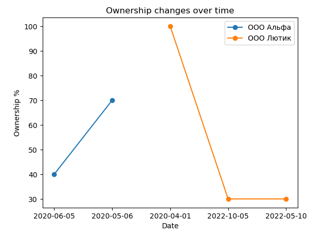

# Aton Analyze

## First chek


## Second check


## Install
```bash
git clone git@github.com:n1ghtmare-dev/aton_test.git
cd aton_test
poetry install
```

## Run
```bash
poetry run python src/aton/main.py
```